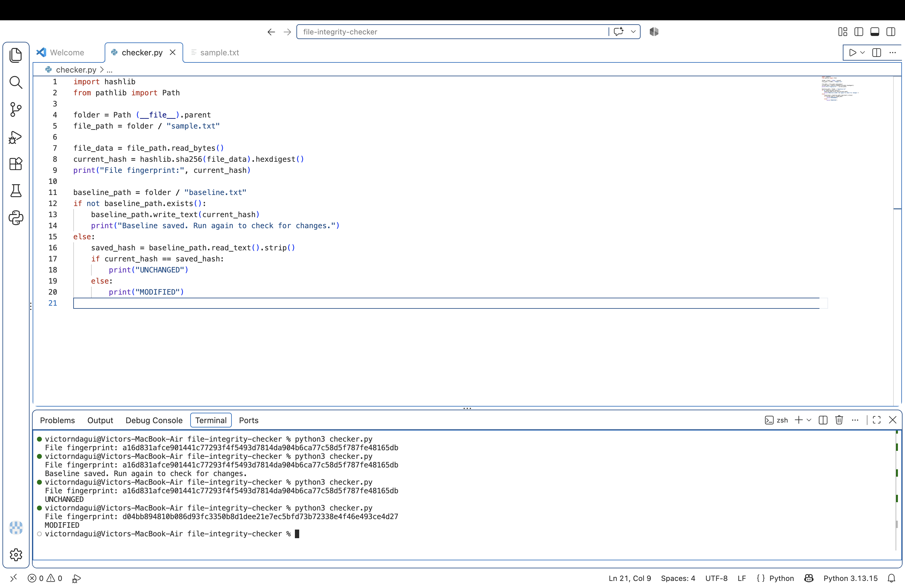
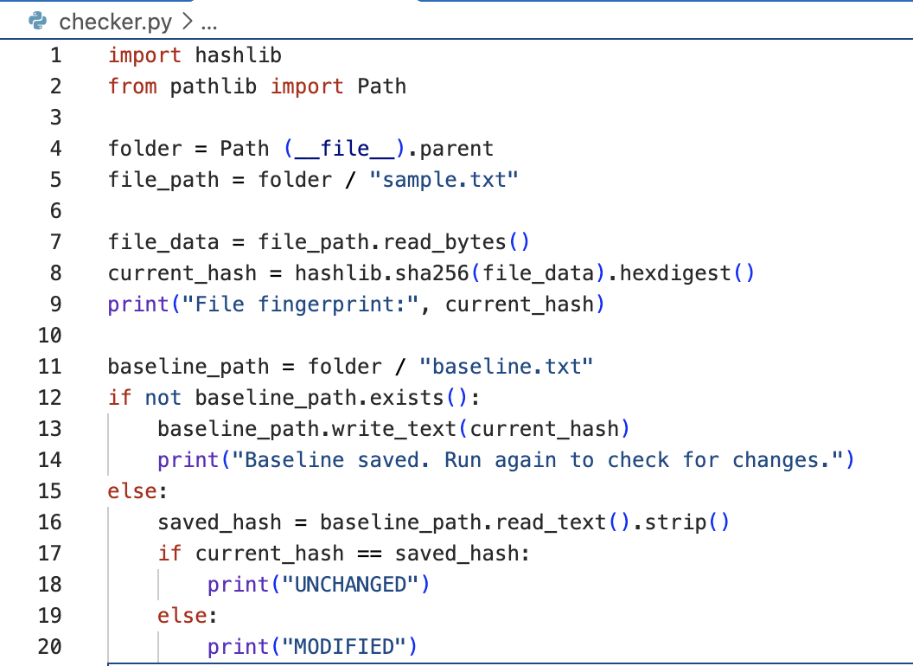
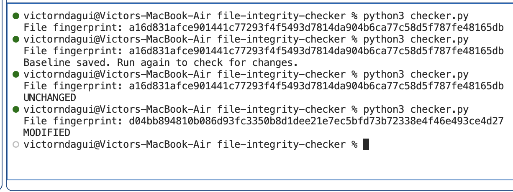

# Python File Integrity Checker

A beginner cybersecurity project built with Python on macOS

## What it does 
Calculates a SHA-256 fingerprint of sample.txt and compares it 
with a saved fingerprint to detect changes.

## How to run
Requires Python3. Open a terminal in the project folder and run: 

```bash 
python3 checker.py
```

- First run: creates baseline.txt
- Later run: displays UNCHANGED or MODIFIED

## Testing
- Ran the checker without changing the files: UNCHANGED.'
- Changed a word, saved, and ran it again: MODIFIED.

## Skills practiced
Python, file handling, SHA-256 hashing, and if/else statements.

## Limitations
Checks one file when run manually. Detects content changes,
but cannot determine whether they are malicious.
The saved baseline must remain trustworthy.

## Project Screenshots

### Python Script and Terminal Full Output


### Python Script for File Fingerprinting


### Terminal Output



